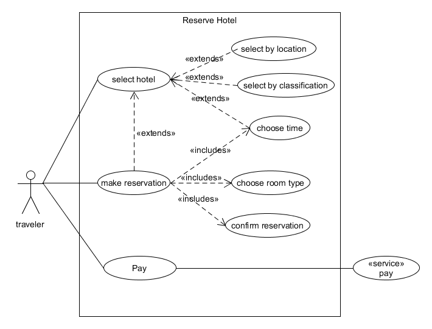
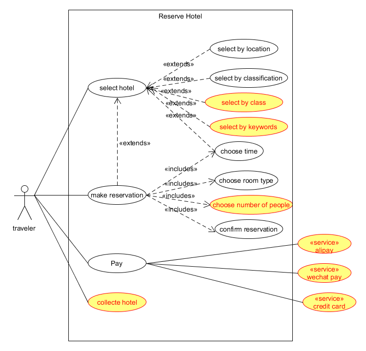
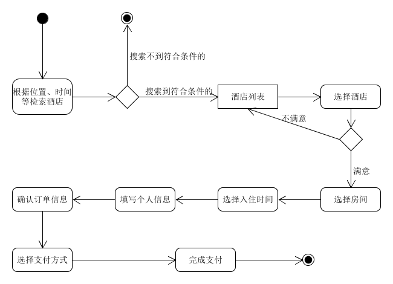
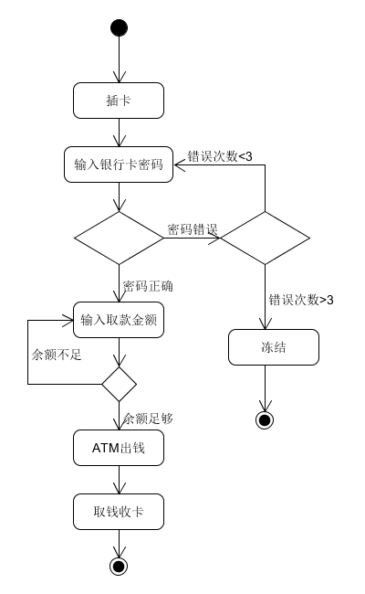
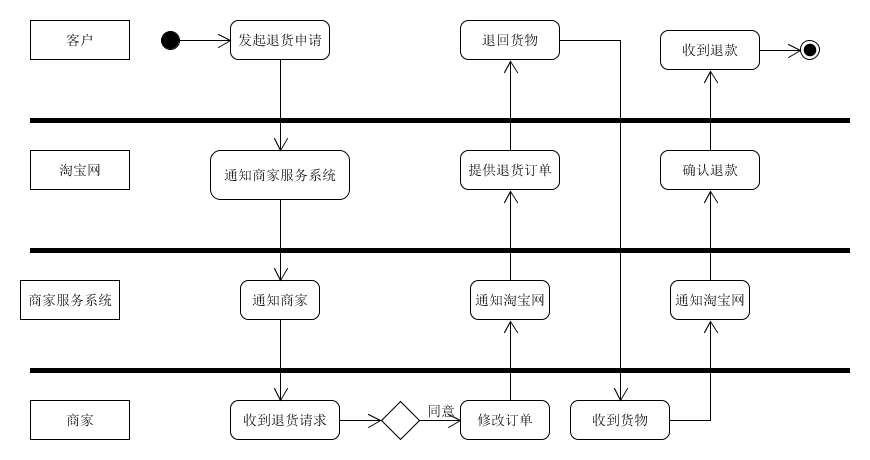

# 系统分析作业3
## 1、 用例建模
* **a. 阅读 Asg_RH 文档，绘制用例图。 按 Task1 要求，请使用工具 UMLet，截图格式务必是 png 并控制尺寸**

* **b. 选择你熟悉的定旅馆在线服务系统（或移动 APP），如绘制用例图。并满足以下要求：**
  - 对比 Asg_RH 用例图，请用色彩标注出创新用例或子用例
  - 尽可能识别外部系统，并用色彩标注新的外部系统和服务

使用携程酒店预定酒店服务http://hotels.ctrip.com/进行绘制用例图

* **c. 对比两个时代、不同地区产品的用例图，总结在项目早期，发现创新的思路与方法**
对比上述两个预定酒店的服务，按我个人看法，后者对客户更贴切，为用户的便捷考虑，我们在早期可以有以下创新的思路和方法：
  * 划分酒店的等级以及类型，方便不同人群快速筛选出适合自己的类型
  * 使用地图的精准定位，为酒店住宿提供更精准的地理位置，方便用户的交通出行
  * 关键词搜索缩短了用户的寻找的时间
  * 更多的支付方式可以留住所有用户
  * 收藏功能可以方便用户的下次预定

* **d. 请使用 SCRUM 方法，在（任务b）用例图基础上，编制某定旅馆开发的需求 （backlog**

|ID|Name|Imp|Est|Iter|How to demo|
|:---:|:---:|:---:|:---:|:---:|
|1|搜索酒店|7|3|1|输入地点，入住以及退房时间，酒店等级分类，关键词可以搜索到相关的酒店|
|2|预定房间|7|6|2|进入酒店，选择房间，入住时间及时长，入住人信息（姓名，电话）|
|3|收藏酒店|6|8|6|点击收藏酒店添加到我的收藏|
|4|完成支付|8|10|3|选择支付，可以选择支付方式有多种，微信，支付宝，信用卡，储蓄卡完成支付|

## 2、业务建模

* **a. 在（任务b）基础上，用活动图建模找酒店用例。简述利用流程图发现子用例的方法。**
活动图：

在画流程图的时候，以下情况可以帮助我们发现一个新的子用例：
>1. 流程图中能进一步抽象起来的某几个步骤可以作为一个子用例
2. 某些步骤是一个循环的情况
3. 显是一个独立的子用例的情况

* **b. 选择你身边的银行 ATM，用活动图描绘取款业务流程**

* **c. 查找淘宝退货业务官方文档，使用多泳道图，表达客户、淘宝网、淘宝商家服务系统、商家等用户和系统协同完成退货业务的过程。分析客户要完成退货业务，在淘宝网上需要实现哪些系统用例**

客户要完成退货业务，在淘宝网上需要实现退货系统、退款系统

## 3、用例文本编写

**在大作业基础上，分析三种用例文本的优点和缺点**
* 摘要 
  * 优点：简洁明了，通常用在主成功场景，能让我们快速了解主题和范围
  * 缺点：只描述了主成功场景，够细致，只用作对问题粗略的认识。
* 非正式 
  * 优点：多个非正式的段落格式，编写简便，比起摘要式用例文本要详细一些，有利于进一步认识问题
  * 缺点：仍不够全面正式，只能做快速了解主题和范围之用，需要在后续阶段细化
* 详述 
  * 优点： 详细编写所有步骤和各种变化，细节充足，正式且深入，且具有结构性，能够直接作为编码的逻辑参考
  * 缺点：编写耗时繁琐，只能对于具有重要架构意义和高价值用例详细编写。